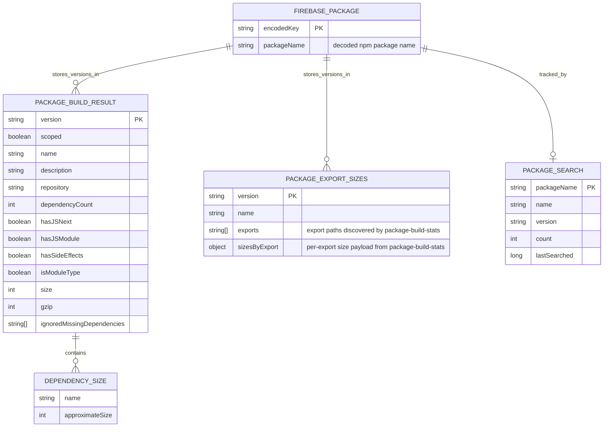
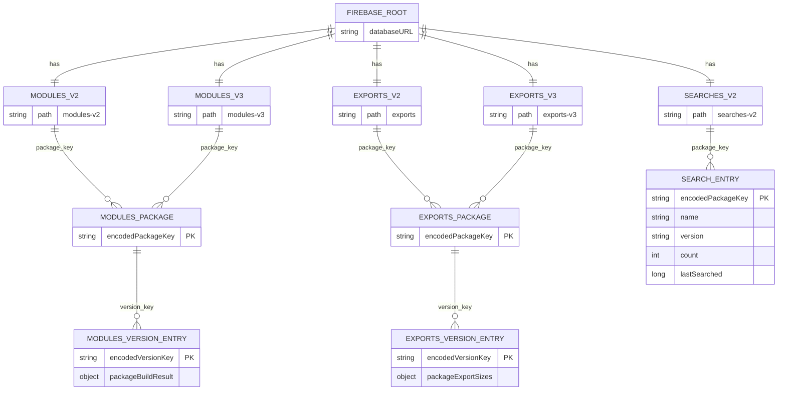

# Firebase Entities

This repo stores Firebase data in the Realtime Database under a small set of top-level nodes.

There are two useful views of that model:

- Logical entities: what shape each stored value has.
- Storage layout: how those entities are keyed under Firebase paths.

`encodeFirebaseKey()` is used for package names and versions before writing keys, so package names like `@scope/pkg` and versions containing reserved Firebase characters are stored in encoded form.

## Logical Entity Diagram

## Realtime Database Layout

## Notes

- `modules-v2` is the legacy package size cache.
- `modules-v3` is the current package size cache, with fallback reads to `modules-v2`.
- `exports` is the legacy export-size cache.
- `exports-v3` is the current export-size cache, with fallback reads to `exports`.
- `searches-v2` tracks recent/popular package lookups and is updated when `/api/size` is called with `record=true`.

## Source References

- [utils/firebase.utils.js](/Users/skanodia/dev/bundlephobia/utils/firebase.utils.js)
- [cache-service/middlewares/package-size.middleware.js](/Users/skanodia/dev/bundlephobia/cache-service/middlewares/package-size.middleware.js)
- [cache-service/middlewares/exports-size.middleware.js](/Users/skanodia/dev/bundlephobia/cache-service/middlewares/exports-size.middleware.js)
- [server/middlewares/results/build.middleware.js](/Users/skanodia/dev/bundlephobia/server/middlewares/results/build.middleware.js)
- [server/middlewares/exportsSizes.middleware.js](/Users/skanodia/dev/bundlephobia/server/middlewares/exportsSizes.middleware.js)
- [**tests**/errors-cache.test.js](/Users/skanodia/dev/bundlephobia/__tests__/errors-cache.test.js)
